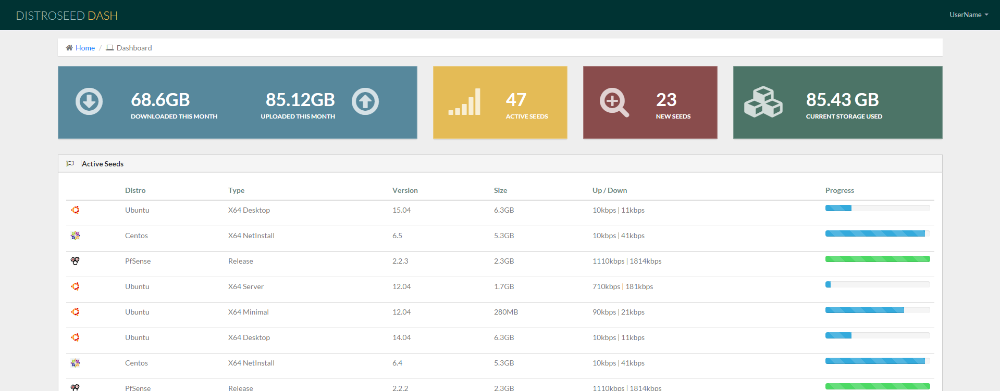
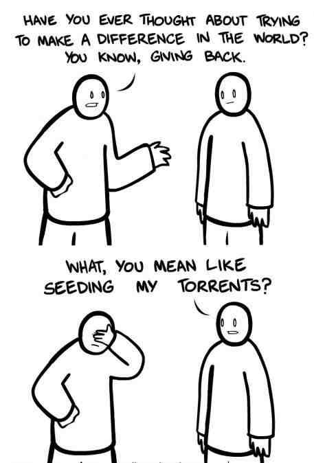

# DistroSeed-Dashboard
DistroSeed is an automated assistant for finding, downloading, and managing Linux Distributions through the Transmission torrent application.



### Features Include: ###
* Great looking dashboard and management interface.
* Automated handling of Linux distributions leveraging DistroWatch tracking information.
* Management of bandwidth allocations, storage limiters, and auto pruning of old torrents.
* Feel good for supporting Linux distribution efforts.



### Take a Peak ###
* [At our site](https://distroseed.com)

### Contributions ###
* Co founded by Ian Norden and Leon Denard

### TODOs ###
* Setup automatic refresh of torrent links
* Finish setup script
* Allow delete of links from edit distro page
* Change username and password from settings page

### Setup Notes ###
#### Setup your environmental variables
```
cp env.example .env
cd scripts
./gen_secret_key.sh
# copy/paste string to .env
nano .env
```
#### NOTE: you can use the transmission built-in or setup yor own by pointing to and existing transmission server

#### build the docker image
```
./build.sh
```

#### run container
#### NOTE: if you use the internal transmission-daemon in the container, you have to manually port forward 51414
```
./run.sh
```